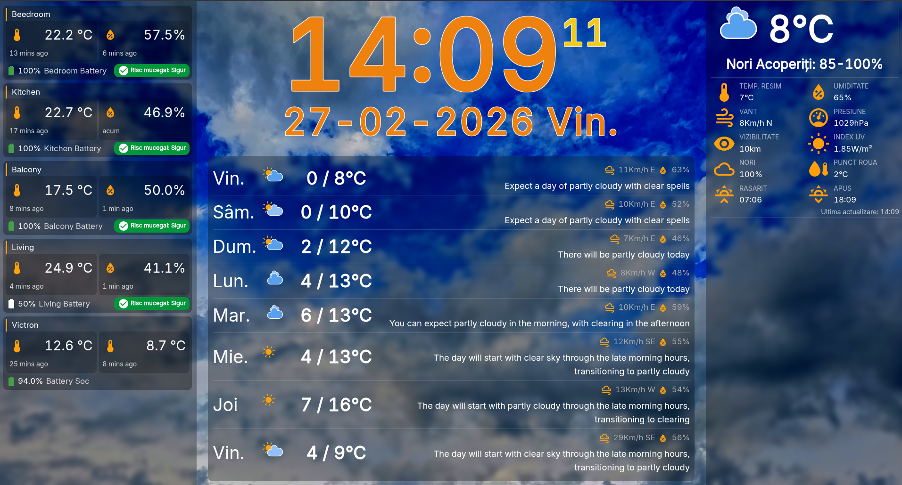
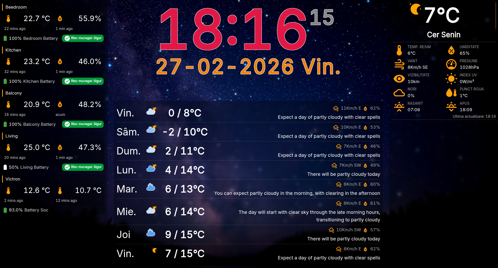

## 🕒 HA Weather Big Wall Clock
#### *__readme and docs are work in process, please be patient__*


[](https://github.com/SoulRaven/ha-weather-big-wall-clock/issues)
[](https://github.com/SoulRaven/ha-weather-big-wall-clock/stargazers)

> 🌤️ A fullscreen Home Assistant Lovelace card designed for wall-mounted tablets,
> kiosks, and digital photo frames — combining clock, weather, local sensors, and
> dynamic video/image backgrounds.
***

## ✨ Features

✅ Large wall-clock optimized for distance viewing<br>
✅ Weather-aware backgrounds (images & videos)<br>
✅ Day / Night automatic theme switching<br>
✅ Designed for kiosk mode tablets & dashboards<br>
✅ Media playlist support<br>
✅ Multiple icon providers<br>
✅ HACS compatible installation<br>
✅ Highly configurable YAML setup<br>

***

## 🧠 Concept
**This card reimagines the classic Home Assistant wall clock by adding:**

 🎬 Dynamic backgrounds based on weather conditions<br>
 🌙 Day/Night themes using the sun entity<br>
 📺 Optimized layout for always-on displays<br>
 🖼️ Support for local or remote media libraries<br>

### Perfect for:

- Wall-mounted tablets
- Smart displays
- Digital photo frames

***

## 🖼️ Preview

***

<p float="center">
  
  
</p>

### Images and Videos

Images are stored in the local folder of the dist. However, they also are stored
in a hosting space on the web, so you can use them even if you don't want to use
HACS, but also you can add your own images by using the media manager
configuration.
Consider also the hosting space is limited and only offered as a bare minimum
solution for the community.
Keep in mind that the card is using a lot of resources, and the video and images
are occupation a lot of space, please consider hosting your own images and
videos. And use the media manager configuration to point to them.

### Icons

Icons are part of several packs available online from different providers.
Icons are downloaded from online resources and are using MIT license or Creative
Commons Attribution 4.0

- [AMCharts](https://www.amcharts.com/free-animated-svg-weather-icons/) - [Creative Commons Attribution 4.0 International Public License](https://creativecommons.org/licenses/by/4.0/)
- [MET Weather API icons](https://github.com/metno/weathericons/tree/main)
- [Makin-Things/weather-icons](https://github.com/Makin-Things/weather-icons)
- [basmilius/weather-icons](https://github.com/basmilius/weather-icons)
- [nrkno/yr-warning-icons](https://github.com/nrkno/yr-warning-icons) - [Creative Commons Attribution 4.0 International Public License](https://creativecommons.org/licenses/by/4.0/)
- [rodrigokamada/openweathermap](https://github.com/rodrigokamada/openweathermap)
- [erikflowers/weather-icons](https://github.com/erikflowers/weather-icons) - *
  *not implemented yet**
***

## 📦 Installation

### ⭐ Recommended — HACS

1. Open HACS
2. Go to Frontend
3. Click ⋮ → Custom repositories
4. Add: https://github.com/SoulRaven/ha-weather-big-wall-clock
5. Select Category: Dashboard
6. Install the card
7. Restart Home Assistant

### or using the link below

[](https://my.home-assistant.io/redirect/hacs_repository/?owner=SoulRaven&repository=ha-big-weather-clock&category=plugin)

### 🔧 Manual Installation

1. Copy the dist folder contents into: */config/www/ha-weather-big-wall-clock/*

2. Add resource:
```yaml
lovelace:
  resources:
    - url: /local/ha-weather-big-wall-clock/ha-weather-big-wall-clock.js
      type: module
```
3. Reload Home Assistant.
***

### 🎨 Themes (Day / Night)

For the day/night circle, the card is using the sun entity as default.
Based on that you have the options to select different themes for the day and night.
The card automatically switches themes using the sun.sun entity.<br>
Currently available options for day/night themes are:
### ☀️ Day Themes

| Type  | Name               | Value              |
|:------|:-------------------|:-------------------|
| Day   | `High Contrast`    | `high-contrast`    |
| Day   | `Safety Vivid`     | `safety-vivid`     |
| Day   | `Solar Bright`     | `solar-bright`     |
| Day   | `Oceanic`          | `oceanic`          |

### 🌙 Night Themes

| Type  | Name               | Value              |
|:------|:-------------------|:-------------------|
| Night | `Night Vision Red` | `night-vision-red` |
| Night | `Low Light Green`  | `low-light-green`  |
| Night | `Deep Indigo`      | `deep-indigo`      |
| Night | `Forest Zen`       | `forest-zen`       |

***
### 🎬 Media Backgrounds

The card supports:

📁 Local media<br>
🌐 Remote hosted media<br>
🎞️ Video playlists<br>
🖼️ Image rotation<br>

⚠️ Videos can consume significant resources.<br>
For the best performance, host media locally.
***

### 🌦️ Weather Providers
| Provider               | Status      |
|:-----------------------|:------------|
| OpenWeatherMap         | Implemented |
| Home Assistant Weather | 🚧 WIP      |
| ANM                    | 🚧 Planned  |
***

### Playlist for images and videos
***

#### Manual
1. Copy the content of the dist archive inside to your `/var/lib/hass/www/ha-weather-big-wall-clock` folder.
2. Click on `Edit Dashboard`,  `Manage resources` add `/local/ha-weather-big-wall-clock/ha-weather-big-wall-clock.js` as
   `JavaScript Module`.
***

### ⚠️ Known Issues
- 📱 Mobile responsiveness still improving
- 🎥 Sometimes the video will play only a few frames then stops. FIX: refresh the page

### ⚙️ Configuration Settings

All the configuration options are available inside the yaml field of the card.
- mediaManager, weatherConfig are a separate object inside the same yaml file

| Element            | Type               | Description                                                                                          |
|:-------------------|:-------------------|:-----------------------------------------------------------------------------------------------------|
| `app.__app_name__` | `String`(readonly) | Internal name of the card. Used in internal works for paths                                          |
| `app.hacs_path`    | `String`           | The path where HACS files are stored.                                                                |
| `webPath`          | `String \| null`   | External URL for media files (CORS must be enabled). When is null, the path for the hacs is used     |
| `videoPath`        | `String \| null`   | Local path or URL for video assets. Layout of the path is: (webPath           hacs_path)/media/video |
| `imagePath`        | `String \| null`   | Local path or URL for image assets. Layout of the path is: (webPath\|hacs_path)/media/img            |
| `iconsPath`        | `String \| null`   | Local path or URL for icon assets. Layout of the path is: (webPath\|hacs_path)/media/icons           |
| `timeFormat`       | `String`           | Time display format (Default: `HH:mm:ss`).                                                           |
| `dateFormat`       | `String`           | Date display format (Default: `DD-MM-YYYY`).                                                         |
| `showAMPM`         | `Boolean`          | Enable AM/PM (requires `hh` or `h` in timeFormat).                                                   |
| `timezone`         | `String`           | `browser` or IANA string (e.g., `Europe/Bucharest`).                                                 |
| `locale`           | `String`           | Language locale for date/time (Default: `en`).                                                       |
| `hidePanels`       | `Boolean`          | Hides side panels to extend media to full width.                                                     |
| `day_night_entity` | `String`           | The entity used to toggle day/night themes (Default: `sun.sun`).                                     |
| `theme.day`        | `String`           | Theme used during the day (HA theme or CSS variable).                                                |
| `theme.night`      | `String`           | Theme used during the night.                                                                         |
| `localSensors`     | `Array`            | List of user-defined sensors to show on the left panel.                                              |
| `styles`           | `String`           | Custom CSS styles to apply to the card.                                                              |

### 🖼️ Media Manager Settings

| Element                       | Type      | Description                                                 |
|:------------------------------|:----------|:------------------------------------------------------------|
| `mediaManager.renderType`     | `String`  | Media types to show: `both`, `images`, `videos`, or `none`. |
| `mediaManager.conditionMode`  | `String`  | Match media using `main` or `description` weather fields.   |
| `mediaManager.useRandom`      | `Boolean` | Randomize media selection on each update.                   |
| `mediaManager.fadeDuration`   | `Number`  | Duration of the fade transition in milliseconds.            |
| `mediaManager.minPlayTime`    | `Number`  | Minimum time to play media before allowing a change (ms).   |
| `mediaManager.minRuns`        | `Number`  | Minimum number of times to play media before changing.      |
| `mediaManager.imageDuration`  | `Number`  | How long an image stays on screen (ms).                     |
| `mediaManager.fallBackImages` | `Array`   | Images used if no condition-specific media is found.        |

### 🌤️ Weather Configuration

| Element                               | Type     | Description                                                    |
|:--------------------------------------|:---------|:---------------------------------------------------------------|
| `weatherConfig.entityId`              | `String` | Home Assistant weather entity (e.g., `weather.forecast_home`). |
| `weatherConfig.weatherProvider`       | `String` | Provider: `homeassistant`, `openweathermap`, or `anm`.         |
| `weatherConfig.owm_apiKey`            | `String` | API Key for OpenWeatherMap integration.                        |
| `weatherConfig.owm_description`       | `String` | OWM mode: `basic` (1 condition) or `detailed` (all).           |
| `weatherConfig.displayMode`           | `String` | Display style: `current`, `forecast`, or `both`.               |
| `weatherConfig.units`                 | `String` | Measurement system: `metric` or `imperial`.                    |
| `weatherConfig.weatherUpdateInterval` | `Number` | Update frequency in minutes (Minimum: 1).                      |
| `weatherConfig.icons.iconSet`         | `String` | Set: `amcharts`, `basmilius`, `metno`, `maskinThings`, etc.    |
| `weatherConfig.icons.type`            | `String` | Icon animation: `animated` or `static`.                        |

## Example of the configuration
Bellow is an example of the configuration for the card.
Card is best used in a single mode using Kiosk options activated.
Recomanded config is to have the dashboard defined inside the `config/lovelace/dashboards.yaml` file.

```yaml
lovelace-bigwallclock:
  mode: yaml
  title: Big Wall Clock
  icon: mdi:clock-digital
  show_in_sidebar: true
  require_admin: false
  filename: lovelace/dashboards/lovelace-bigwallclock/bigwallclock.yaml
```
Then inside the `bigwallclock.yaml` file
```yaml
title: Big Wall Clock
#background: var(--background-image)
#background: 'center / cover no-repeat url("/local/backgrounds/grey2.jpg") fixed'
decluttering_templates: !include_dir_merge_named lovelace/decluttering_templates/
views:
  - !include views/bigWeatherClock.yaml
```

And finaly the `bigWeatherClock.yaml` file

```yaml
title: Wall Clock
type: panel
cards:
  - type: custom:big-wall-clock-video
    day_night_entity: sun.sun
    timeFormat: 'HH:mm:ss'
    dateFormat: 'DD-MM-YYYY ddd'
    timezone: 'Europe/Bucharest'
    locale: 'ro'
    showAMPM: true
    hidePanels: false
    theme:
      day: 'solar-bright'
    webPath: 'https://media.progeek.ro'
    mediaManager:
      renderType: 'both'
      conditionMode: 'description'
    localSensors:
      - name: 'Beedroom'
        device_entity: 'cb87dabaf5ecc0d1beb3a33a4772d4ef'
        extra_entities:
      - name: 'Kitchen'
        device_entity: 'e5a604226563a11b89c8172c2e957831'
      - name: 'Balcony'
        device_entity: 'a7e9e6f6543a325d47ffc8aec35f7cde'
      - name: 'Living'
        device_entity: '41b8b4b0e732d704dc65db39d02f41d2'
      - name: 'Victron'
        extra_entities:
          - 'sensor.victron_temperature_temperature_6'
          - 'sensor.victron_battery_temperature_2'
          - 'sensor.victron_battery_soc_2'
    weatherConfig:
      weatherProvider: 'openweathermap'
      owm_apiKey: !secret openweathermap_api_key
      owm_description: detailed
      owm_conditions: detailed
      language: 'en'
      showLabels: true
      units: 'metric'
      weatherForecastDays: 8
      icons:
       iconSet: 'maskinThings'
       type: 'animated'
```
***

### 🛠️ Development
```shell
npm install
npm run build
```
Webpack builds assets into /dist.
***

### 🤝 Contributing

Contributions, issues, and feature requests are welcome! <br>
If you test the card on real wall displays — feedback is extremely valuable.

### 📜 License
GPL-3.0 License
***

### ⭐ Support

If you like this project:

 ⭐ Star the repository<br>
🐞 Report issues<br>
💡 Suggest features<br>
***

~~If~~ When you experience issues/bugs with this, the best way to report them is
to open an issue in **this** repo.
[Issue link](https://github.com/SoulRaven/ha-weather-big-wall-clock/issues)
***

## 👀 Author
**Zaharia Constantin**<br>
[View my GitHub profile 💡](https://github.com/soulraven)
